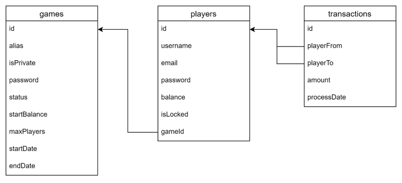

# mbank-api

The API provides an interface between front end clients and mbank database. As part of the implementation, users are required to register and login to obtain a token. All other request require the authorization header containing the bearer token.

## Pre-requisites

- Node.js
- Docker

## Setup

- Copy the `.env.sample` file to `.env` and update the values

```env
DB_USERNAME=mbank
DB_PASSWORD=mbank
DB_DATABASE=mbank
DB_HOST=localhost
DB_PORT=3306
DB_DIALECT=mysql
JWT_SECRET=jwtpassword
```

- Update the `docker-compose.yml` to have the same values provided for the following section:

```yaml
environment:
  - MYSQL_ROOT_PASSWORD=mbank
  - MYSQL_DATABASE=mbank
  - MYSQL_USER=mbank
  - MYSQL_PASSWORD=mbank
```

## Run

**Build containers**

- Open a command line and execute the following from the project root:

```bash
docker-compose -p "mbank" up
```

**(Optional) Database login**

If you want to examine the database from a browser, do the following:

- Open the browser and navigate to `http://localhost:8001`
- When prompted, provide the username and password defined with `MYSQL_USER` and `MYSQL_PASSWORD` above

**Run the Database Migrations**

- Open the mbank-api project from the command line and enter the following:

```bash
npm install

npx sequelize-cli db:migrate
```

- Run the seeds if you want sample data to test. Run the command below:

```bash
npx sequelize-cli db:seed:all
```

**Start Node Application**

- Open the mbank-api from a command line (_Git Bash preferred on Windows_)
- Enter the following commands to start the application:

```bash
npm start
```

- Test the application by opening Postman or a Browser and go to `http://localhost:3000/`

For a full listing of available endpoints, see the section below.

## Stop and Restart

**Stop a running stack**

If the stack is currently working up and running, execute the following to stop stack without destroying anything.

```bash
docker compose stop
```

_WARNING_ This will take a few minutes to bring down completely and the volumes remain running but that's fine.

(Optional) If the containers do not stop after a few minutes, you could execute a kill command.

```bash
docker compose kill
```

**Restart a stack**

To restart the stack without recreating it, run the following:

```bash
docker compose start
```

## Database Design



## Available Endpoints

| URL                | Method | Required Payload             | Query Params         | Auth | Description                     |
| ------------------ | ------ | ---------------------------- | -------------------- | ---- | ------------------------------- |
| /games             | GET    |                              | status               | Yes  | Get a list of all games         |
| /games             | POST   |                              |                      | Yes  | Create a new games              |
| /games/{id}        | GET    |                              |                      | Yes  | Get a single game by id         |
| /games/{id}/join   | PATCH  |                              |                      | Yes  | Join an existing game           |
| /games/{id}/start  | PATCH  |                              |                      | Yes  | Start a game that is starting   |
| /player            | GET    |                              | isLocked             | Yes  | Get a list of all players       |
| /player/{id}       | GET    |                              |                      | Yes  | Get a single player by id       |
| /transactions      | GET    |                              | playerFrom, playerTo | Yes  | Get a list of transactions      |
| /transactions      | POST   | playerFrom, playerTo, amount |                      | Yes  | Get a list of transactions      |
| /transactions/{id} | GET    |                              |                      | Yes  | Get a single transactions by id |
| /user/register     | POST   | {username, email, password}  |                      | No   | Register user and get token     |
| /user/login        | POST   | {username, password}         |                      | No   | Login to mbank and get token    |
